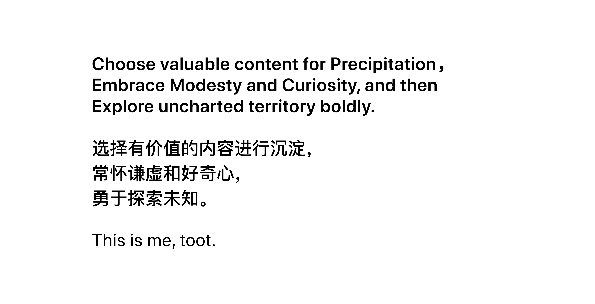

  

Hey👋 Nice to meet U (๑¯◡¯๑) Wish you a good day! ✨

> Hypophora Time!

🌷 Who am I? I'm a ...

· Front end developer on [React](react.dev).

🍓 What am I doing? I am exploring...

· UI/UX Design
· Web 3D
· Data Visualization.

🍧 Where are your beautiful Works recommended?

1. 

🪻 Have you devoted to Open Source? 

Sure! The following are my engagements: ...
1. MDN Web Docs - MDN 中文文档翻译
Repo: https://github.com/mdn/translated-content
CSS排版 - 网格: https://developer.mozilla.org/zh-CN/docs/Learn/CSS/CSS_layout/Grids
 
2. React Doc
3. Three.js 中文文档翻译
Repo: https://github.com/threejs

