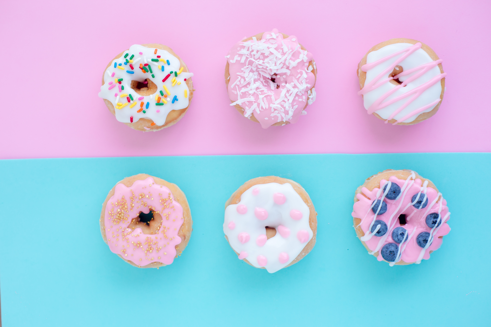

  

Glad to meet you! 

- I am a junior Product Manager. 

- Interested in UI/UX design, web 3D and data visualization. I am also a front-end developer, capable of Vue.js and React.js.
- QaQaqqqqqqq

- Learning Figma, Axure, Next.js and Three.js.

  

  

  

