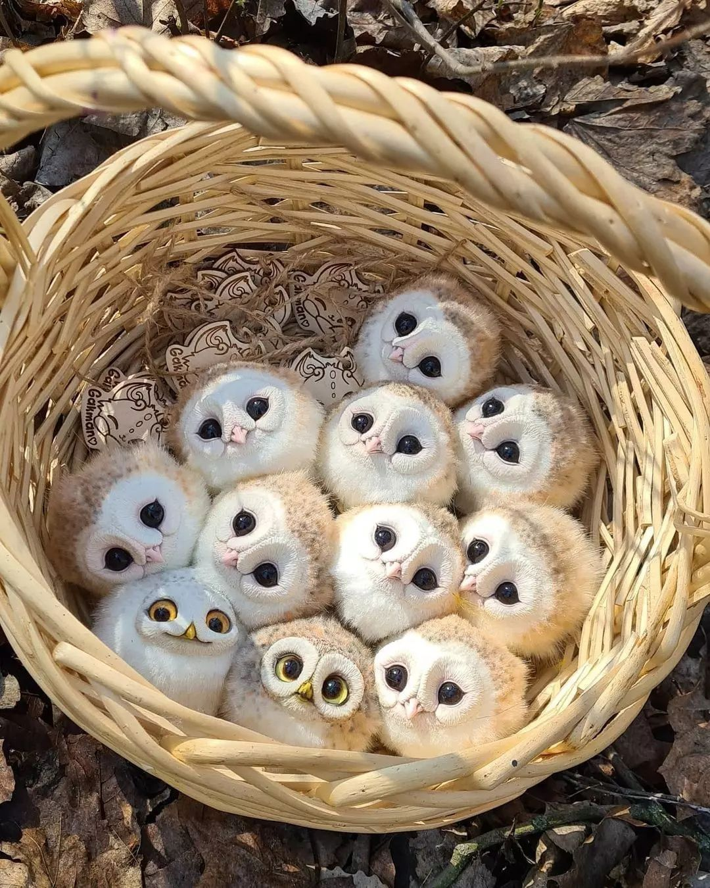

Hi, my name is **Vooce**. I'm a Go developer from China. I also write Python, JavaScript & Rust. 

### My open-source projects

- [three.bingo](https://three.bingo) - My Three.js demos.
- [interview](https://github.com/xext/interview) - 面试导向的 Go 学习仓库.
- [School](https://github.com/Gophist/School) - Recommended Online Courses

<!-- 
 -->

### My Love

- [BFY](https://bfy.jun.one), eat Cookies 🍪, Formula One 🏎️, Liverpool FC

### Techs I'm working with

<h5>
   &nbsp;&nbsp;&nbsp;
   &nbsp;&nbsp;&nbsp;
   &nbsp;&nbsp;&nbsp;
   &nbsp;&nbsp;&nbsp;
    &nbsp;&nbsp;&nbsp;
   &nbsp;&nbsp;&nbsp;
   &nbsp;&nbsp;&nbsp;
    &nbsp;&nbsp;&nbsp;
</h5>

  &nbsp;&nbsp;
  
  <!--  -->

