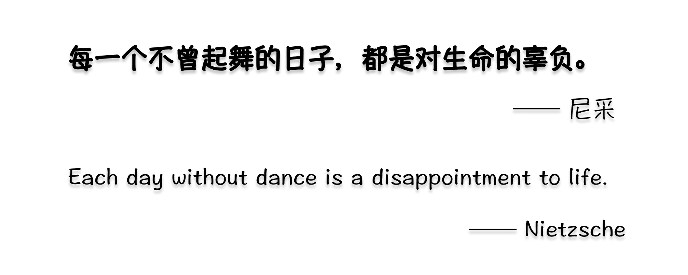

## Hey 👋, I'm Romance.  

### Glad to see you here! 

<!--  -->

*Hi, I'm Romance, 刘俊 Liu Jun, an ENFJ developer with ❤️.*

<!-- &nbsp;&nbsp;  -->

<!--
- My Coding Time:  -->

- Contact me 

- My Design 

- Mastodon (Micro-blog): [@Romance@mas.to](https://mas.to/@Romance)

## Languages and Tools

 

 

## Github Status

  &nbsp;&nbsp;
  
  

## My Demos

1.合同风险报表 Contract Risk Report 

Repo: https://github.com/rmne/Contract-Risk-Report

Preview: https://chart.jun.one

